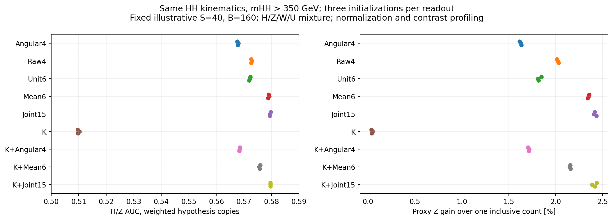
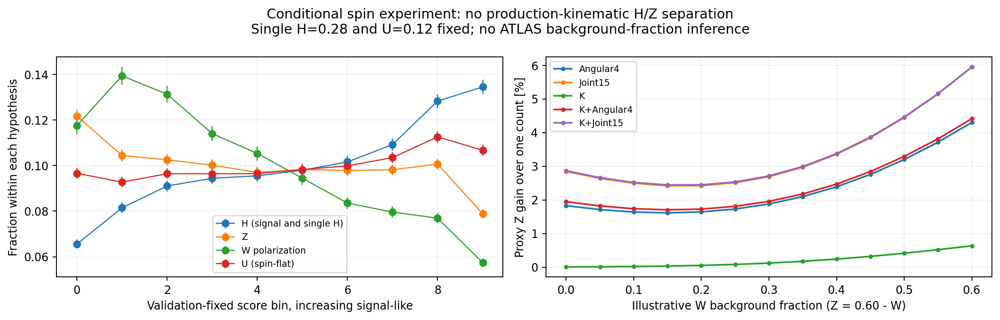
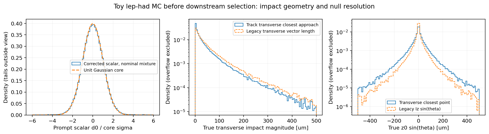
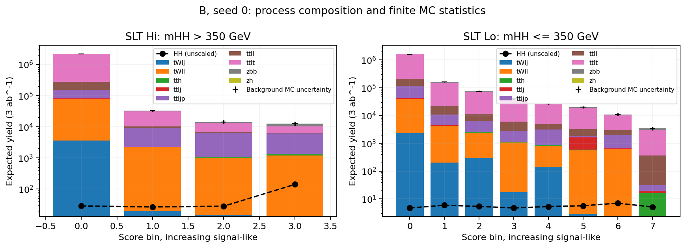
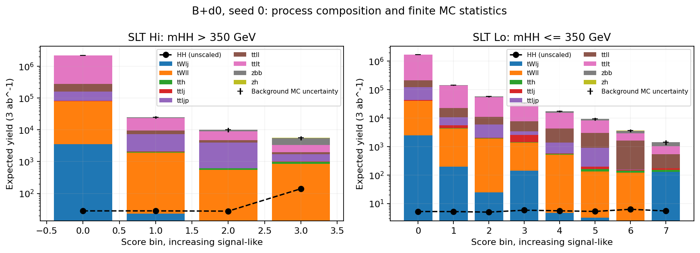

# 最新HH解析を踏まえたTauSpinとレプトン寿命情報の再検証

2026-10-08、ARIADNE Research run。問いは、旧runが示した改善率と新規性を、現在のATLAS HH→bbττ解析に照らしてどこまで維持できるかである。

最新文献との照合から、旧runの受容率回収シナリオと新規性の説明は修正が必要と分かった。同じTauSpin推定値を使う数値実験では、ベクトルの大きさを残す入力に小さな性能差があった。一方、二体積を別に回帰する方法の固有の上積みは、平均ベクトルの外積を加えた入力との比較では分離できなかった。

レプトン寿命情報は、横IPの幾何と尤度の数値計算を修正し、四層Transformerで比較した。名目toyでは利得があったが、初期値、非即発背景、有限MCへの依存が大きい。今回の改善比は、最新ATLASへの安定した改善率として使えない。実解析への追加感度を判定するには、実際のID・isolationを通過したsignal/top/fakeのe/μ別d₀ template、最新分類器scoreとの事象対応、control regionを含む尤度が必要である。

## 最新の解析が変えた前提

ATLASの[最新HH解析（2607.26879 v1）](https://arxiv.org/html/2607.26879v1)では、独立した横impact parameter（d₀）のcutを課さず、縦IPに |z₀ sinθ|<0.5 mm を課す。lep-hadは単一レプトントリガーのみを使い、40<m_bb<150 GeV、m_vis>40 GeV、MMC質量>60 GeVを要求する（§§4,5.2）。したがって、旧runの「d₀ cutを外して信号を回収する」改善を、最新解析への追加効果として数えることはできない。

イベント分類器はTransformerへ進んでいる。公開されたTable 2にlepton d₀やpolarimetric vectorの明示入力はないが、objectの同定に使う情報まで未使用と推定することはできない。とくにTightLH electron IDの参照文献[2308.13362 §3.2](https://arxiv.org/html/2308.13362v2)は、[1908.00005 §6.1 / Table 1](https://arxiv.org/html/1908.00005v2)のd₀とd₀ significanceを含む標準likelihoodを参照している。ただし、最新HH campaignでIP変数を除外する設定が使われたかは、この参照関係だけでは確認できない。独立cutが無いことは確認済みだが、実際のID選択の変位依存は未検証である。

[公式補助表2](https://atlas.web.cern.ch/Atlas/GROUPS/PHYSICS/PAPERS/HIGP-2024-37/tabaux_02.pdf)のSR Hi Run 2では、背景約4.18万のうちtrue-τを含むtt̄約2.19万、fake-τ約1.70万である。これは領域全体のpost-fit集計で、最終分類器の高scoreビンの組成を与えない。旧toyのsingle-H/Z/W/fake比率を最新解析へ移す根拠には使わなかった。公開論文、公式図表、INSPIRE参照先は確認できたが、このrunではイベントMCやATLASの統計workspaceを取得できていない。

新規性にも先行研究がある。[TauPolaris（2608.10961 §VII）](https://arxiv.org/html/2608.10961v1)は、CP角を固定しない四つの角度変数によるH/Z背景抑制を提案済みである。レプトンd₀を用いたprompt/τ由来の分離にも[ATLAS muon測定](https://arxiv.org/abs/2007.14040)、[electron測定](https://arxiv.org/abs/2412.11989)、[LFV分類器](https://arxiv.org/html/2302.05225v1)の先例がある。今回の判断対象は、これらの情報がHHの強い分類器へ追加で役立つかである。

## 同じスピン推定値から何を残すか

spin-flat HHの58,805事象にH/Z/W/Uの非負spin weightを与え、全armで同じkinematicsと同じTauSpin推定値を使った。Uはspin-flat、Wはここで定義した偏極仮説であり、実際のfakeやtop背景を生成したものではない。学習・validation・評価を事象単位で分けた後に、各仮説への重み付きコピーを作った。

Angular4はTauPolarisの四つの変数を単位ベクトルで作る。Raw4は同じ四つを推定ベクトルの大きさも残して作る。Unit6とMean6は両τの六成分をそれぞれ単位化して／せずに与える。ここで二体積とは、両τのpolarimetric vectorの成分積 h⁺ᵢh⁻ⱼ（i,j=n,r,k）の九成分である。Joint15はMean6に、それらを別に回帰した推定値を加える。spin入力には共通の崩壊モードフラグ十成分を付ける。Kはkinematics、K+は同じkinematicsへの追加を表す。TauPolarisの学習済みnetworkを動かした比較ではない。

ここでは、尤度をprofileして求める有意度をZと書く。Z比は、二つの入力条件で得た有意度の比である。

再構成m_HH>350 GeVで、K+Joint15/Kの仮想profile significance比は三初期値の平均で+2.373%。seed 0のpaired MC bootstrap中央値は+2.394%、68%区間は2.293–2.468%だった。Kにも同じ崩壊モードフラグを与えたK+Modesとの比較では+2.379%、95%区間は2.223–2.543%で、改善はフラグ追加だけでは説明されなかった。収量S=40、B=160とsingle-H/Z/W/U比率0.28/0.44/0.16/0.12を固定した条件付き実験の数値である。この比を最新ATLASのsignificanceやκλ精度へ換算してはいけない。

| 比較（m_HH>350 GeV、seed 0） | Z比の増加中央値 | 68% paired MC区間 |
| --- | ---: | ---: |
| Raw4 / Angular4 | 0.382% | 0.342–0.439% |
| Mean6 / Unit6 | 0.490% | 0.448–0.535% |
| Joint15 / Angular4 | 0.777% | 0.725–0.836% |
| Joint15 / Mean6 | 0.057% | 0.037–0.086% |
| K+Joint15 / K+Mean6 | 0.275% | 0.239–0.301% |

左はH/Z仮説の重み付きAUC、右は同じ収量を一つのcountで扱う場合に対するZ増加率。各入力の三点は初期値だけが異なる。kinematicsが全仮説で同じなのでKの識別力はほぼ無く、ベクトル情報を残すとAUCが約0.58へ上がる。ベクトルの大きさを残す差と、単位ベクトル化の際に失う差を同じ事象で比較できる。

Angular4はCP角に依存する横方向の情報を意図的に捨てるため、Joint15との差を全て「二体積の追加情報」とは読めない。またK+Mean6はMean6単体よりZが0.18–0.20%低かった。これらは固定したXGBoostが取り出した性能差であり、利用可能な情報量の厳密な増加ではない。回帰ベクトルの大きさも、校正済みのconfidenceと解釈していない。

そこでMean6の外積九成分を明示的に加えたProduct15を同じ条件で学習した。Joint15/Product15は+0.0049%、95%区間−0.0276–+0.0419%。K付きでも+0.0318%、同区間−0.0050–+0.0684%だった。この固定learner・seed 0のcontrolでは、平均ベクトルの積を入力すると、joint regression固有の上積みは分離できなかった。二体情報そのものが存在しない、または平均の積が十分統計量だと示したわけではない。

左はK+Joint15、seed 0の評価foldで、各仮説を独立に総和1へ規格化したscore-bin分布とMC誤差。Hは高scoreへ、Wは低scoreへ偏り、Zの傾きは小さい。右は学習済みmodelとbinを固定したままW/Zの比率を変えた応答で、仮定した背景組成への依存を示す。最新ATLASの組成を推定する図ではない。

## レプトン寿命の比較で直したこと

### 評価対象と修正

旧模擬は、3D closest-approach vectorの横方向の長さをd₀としていた。今回、trackの横平面でのclosest approachを計算し、スカラーd₀へ幅σのGaussian誤差を加えた。z₀も横平面でclosestとなる点から求め、縦z₀の誤差にsinθを掛けて選別した。

本比較は単一レプトントリガーと上記SRの質量条件を満たす247,608事象を使う。再構成m_HH>350 GeVをHi、350 GeV以下をLoとして同時にfitする。4 layers / 4 heads / d_model 64のTransformerに、b1、b2、lepton、τ、METのtokenと利用可能なkinematicsを与える。この入力をbaseline Bと呼ぶ。B、B+d₀、B+Had、B+d₀+Hadを同じfold・同じ乱数・三初期値で比べる。d₀入力は |d₀|/σ(d₀) とσ(d₀)。Hadは崩壊モード五フラグ、荷電／中性エネルギー非対称、MMCで推定した可視τのエネルギー比、局所基底へのMET二射影であり、spinだけへの帰属は行わない。真の横d₀だけをゼロにするnullは、本比較と縦IP・選択事象が完全に一致する。

最新ATLASと合わせたのは、保存済みMCで復元できる選別と分類器の骨格である。GN2のscore、VBF/追加jetのtoken、MMC object token、親粒子の補助学習、実測ID・isolation効率、control regionを含むfitは無い。とくにelectron IDは一定効率のtoyであり、実際のcampaignにおけるID選択の変位依存を検証していない。固定したmodelのelectron/muon別診断と、分解能・nonprompt模擬も併記して、この仮定への依存を点検する。

### 名目toyの結果

固定scoreを安定化した尤度で再評価すると、B+d₀/BのZ比は三初期値で2.338、1.420、1.378。全22 Transformerのprofileは収束し、点推定の全binが有限MCの基準を満たした。しかし100回のpaired MC bootstrapは次のように広い区間を与えた。これは固定modelと固定binへの条件付き区間で、再学習やID・検出器の不確かさは含まない。

| 初期値 | B+d₀/Bの点推定 | 68% paired MC区間 | B+d₀+Had/Bの点推定 | 68% paired MC区間 |
| --- | ---: | ---: | ---: | ---: |
| seed 0 | 2.338 | 1.811–3.504 | 1.524 | 1.293–1.949 |
| seed 1 | 1.420 | 1.168–1.796 | 1.321 | 1.164–1.684 |
| seed 2 | 1.378 | 1.172–1.641 | 1.057 | 0.959–1.209 |

本比較の九つの比は全て100/100のbootstrap fitが有効だった。B+d₀/Bの95%区間はseed 0で1.454–4.362、seed 1で0.982–2.335、seed 2で0.998–2.074であり、三初期値に共通する精密な改善率を確定するにはMC精度が足りない。Had単独の点推定は0.854–1.012。Hadを含むbaselineへのd₀追加でも、seed 2の68%区間は0.969–1.193と1を跨ぐ。入力を増やせば必ず良くなるという結果ではない。

### 背景・有限MCへの依存

真の横d₀を消した対照は1.004、分解能を拡大した条件は1.561、そこにfake候補の50%へ非即発変位を加えると0.873だった（各seed 0の点推定）。名目toyではd₀入力がこの分類器の性能を上げたが、改善率は初期値と背景の即発性に依存した。非即発stressのseed 0は、固定learnerのprofile Z比の点推定で改善を示さなかった。この条件にはpaired区間がなく、統計のみの比は約1.005であるため、0.873への低下を全て物理的な識別力の低下へ帰属しない。これらのstressは校正済みの不確かさ区間ではない。

絶対Zも適用範囲を示す。Bの三初期値は0.069–0.080に留まり、背景の有限MCを無視したgroup-normalization-onlyでは0.77–0.83、統計のみでは1.29–1.33だった。統計のみのB+d₀/B比は1.20–1.48で、有限MC込みの大きな比とは異なる。このtoyの感度は有限MCの制約に強く依存する。四層Transformerを使ったことだけで、最新ATLASの分類器とfitの性能を再現したとは言えない。旧runの×1.13–1.21やHH組合せ4.3σへの換算は、最新解析に対する現在値として維持しない。

e/μ別にも同じ固定modelを評価したが、両flavorともbaseline BのLo最高score binがMC-support基準を満たさなかった。したがって全てのflavor別比を参考診断に留め、e/μのどちらが改善を担うかはこのMCから確定しない。補助GBDTは両armとも学習が収束したが、BのLo bin 7が同じ基準を満たさず、比1.329も参考診断に留めた。収束した計算と、物理的に使える推定を区別した。

選別前のtoy MC。左は即発レプトンのd₀/σの分布で、Gaussian coreに2%の4σ tailを加える入力モデルの応答を示す。中央はτ由来レプトンの横距離で、旧vector長の定義はtailを過大にした。右のz₀ sinθは逆に、旧定義が縦tailを過小にした。各histogramは表示区間へ規格化し、overflowを含まないため、図からtailの混合率そのものを測っていない。旧d₀の値を単に新分類器へ渡す比較は避けた。

どちらもseed 0、評価foldのtoy 3 ab⁻¹収量。左がHi、右がLoで、横軸はvalidationで固定したsignal-like score bin。stackはprocess別背景、黒い棒は背景MC誤差、黒の破線は拡大していないHH信号。入力ごとにvalidation binの位置は異なる。高scoreでも背景が信号より大きく、MC誤差は信号の規模を上回る。この構造が、有限MCを入れた絶対Zの小ささと幅広い比の区間を生む。最新ATLASのscore-bin収量を示す図ではない。学習過程は[seed 0の曲線](figures/lephad/learning_seed0.png)にあり、全モデルはvalidation停止点を持つ。

## 今回の判定

旧runで未確定だった「最新解析に独立d₀ cutがあるか」は解決し、cutを外す受容率回収案は適用外となった。H/Zのspin背景抑制とレプトン寿命分離には先行研究があり、その発想自体を新規性にはしない。今回の同一推定値による比較では、TauSpin推定ベクトルを用いた入力の条件付き改善は残った。ただし、二体積を別に回帰する方法の固有の上積みは、平均ベクトルの外積を加えた入力との比較では分離できなかった。

寿命入力は名目toyでこの分類器の性能を上げる一方、初期値、非即発背景、有限MCへ強く依存し、最新解析への安定した改善率を示すには至らない。次に実解析への追加感度を判定するために必要なのは、実際のID・isolationを通過したsignal/top/fakeのe/μ別d₀ templateと、最新classifier scoreとの事象対応、およびcontrol regionを含む尤度である。公開文献だけではこの対応を補えず、今回のtoyの改善比で置き換えない。

## 補足：再現条件と適用範囲

- 固定条件の詳細は[latest_protocol.md](../../latest_protocol.md)。事象uid modulo 3でtrain 0、validation 1、評価2。以前も見たMCの再利用なので探索的な比較である。seed差は初期値の差で、独立datasetやfold差ではない。
- spinの本比較は9入力×3初期値、補助controlはProduct15、K+Product15、K+Modesの各seed 0。全てvalidation lossによる停止、100 paired event bootstrap。区間はseed 0・固定model・固定validation binに条件付け、trainingや検出器の不確かさを含まない。学習曲線は[spin_learning.png](figures/spin_learning.png)、paired比較は[spin_paired_contrasts.png](figures/spin_paired_contrasts.png)。
- spinのval binはliteral raw W@fractionのacceptance-weighted quantile。各hypothesis templateは後で別々に規格化した。対照shapeへの25%以内の混合は各仮説への模擬で、S/(S+B)=0.20の場合、背景全体のsignal方向への最大変化は5%。校正済みsystematic uncertaintyではない。
- 寿命比較のbinはvalidation signal quantileから始め、aggregate background ESS≥25、B≥3となるようmergeする。Hi/Loのgroup normalizationを共有し、正のlognormal nuisanceと背景の有限MCのeffective-count Poisson nuisanceをprofileする。signal MCの変動はpaired bootstrapに含むがprofileの補助nuisanceには含めない。評価foldのpoor binを隠すfloorや代替shapeは使わない。
- 幾何の検証では、584,059事象のraw対応は全て一対一で、横距離の幾何closure残差は2.3×10⁻¹³ µm。prompt coreの誤差pullは平均0.003、幅0.998だった。
- レプトン分解能のtoyはmuon σ(d₀)=sqrt(10²+(150/pT)²) µm、electronはその1.2倍、σ(z₀)=sqrt(20²+(300/pT)²) µm、2%の4σ tail。分解能拡大・electron tail・nonprompt displacementは名前付きstressで、検出器の校正や信頼区間を与えない。
- spin入力の正本とhashは[input_provenance.json](spin/input_provenance.json)。h回帰は専用trainH/trainZ（H/Z+jet）で学習したcheckpointをspin-flat HHへ適用した。保存されたexact h六成分とkinematics四成分のfloat64 bytesを照合し、train 526,859行と適用先58,805行に一致は無かった（[照合結果](spin/source_overlap_check.json)）。これは保存済み行の監査で、全生成粒子や乱数streamの独立性までは検証していない。
- sourceはspin学習38cad2d、plot6433ce2、Product control 0be8ffb、mode control be1b95d、寿命の学習e34d272、尤度の再評価9f4b634を使う。remoteはlxgpu02、`~/dihiggs-latest-20261008/`。大量のscore、model、生logはremote正本に保つ。
- 寿命の事前pilotはcommit前のfile copyで実行した。本番はe34d272のclean archiveで固定し、保持されたpilotのruntime関連七fileは本番sourceとSHA256が一致した。これは保持copyの照合で、pilot開始時にcommit receiptを作っていたとの主張ではない。
- 初期のSLT/LTT試行は文献の§5.2に基づいて中断した。自動作成された二つの評価記録の性能は読んでおらず、入力・architectureの選択には使っていない。
- 本学習22モデルと補助GBDT二モデルは全て収束したが、初期の尤度profileは16/24で数値的に失敗した。相対Poisson devianceと解析的微分へ直し、同じtemplateの全24profileを独立なθ・β同時fitと照合した。Zの相対差は最大1.88×10⁻¹⁴、統計のみの解析式とは1.20×10⁻¹⁴で一致した。最終の2,296 profile fitは全て成功した。これは計算の修復で、学習、score、選択、nuisanceを変更していない。独立レビューの指摘と反映は[review.md](review.md)にまとめた。

作業担当者：GPT-6（runtimeはvariant/effortを公開していない）。設計・実装・結果のvalidity reviewは同providerの独立instance。
