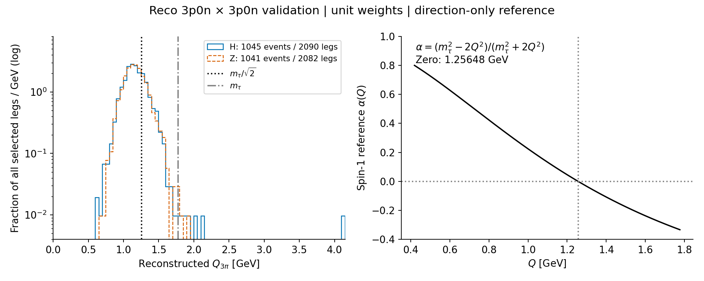
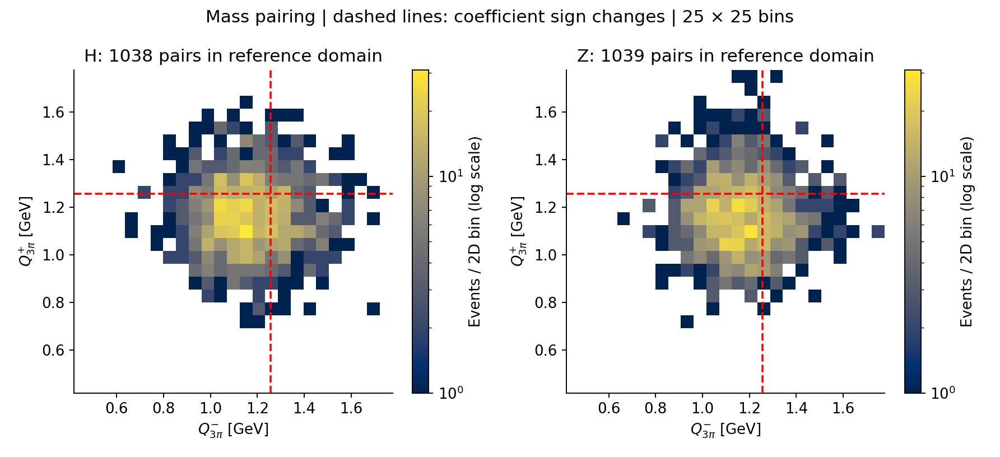
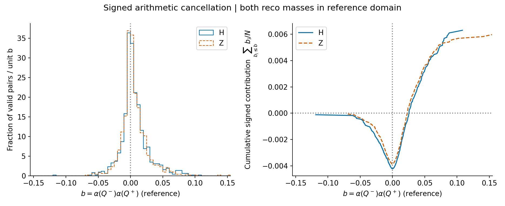

# 3πの質量を平均すると、解析係数はどれだけ相殺されるか

3π系の方向に対するスピン応答を表す参考係数は、3πの質量によって符号が変わる。再構成3p0n×3p0nのvalidation標本で、両側の質量が式の参照領域（3mπ≤Q≤mτ）に入るeventを調べると、両側の係数の積は約40%で負になった。符号付き平均は絶対値の平均の約43%で、H/Zの両方に同程度の相殺が見えた。これは再構成質量から作った参考係数の算術的な性質であり、現在のTransformerのAUC低下を説明した結果ではない。

## なぜ質量を見るのか

直近の3-prong診断では、崩壊モードの取り違え、専用学習、β/γの明示的追加、学習標本数だけでは低いAUCを説明しにくかった。そこで今回は、3π系を一つのspin-1系として見るとき、質量によりスピンに対する応答の符号が変わる点を調べた。

[Kühn (1998), §2](https://www.actaphys.uj.edu.pl/fulltext?page=1371&series=Reg&vol=29)では、3π系の不変質量をQとすると、内部の崩壊構造を積分したspin-1系の方向解析係数は

\[
\alpha(Q)=\frac{m_\tau^2-2Q^2}{m_\tau^2+2Q^2}
\]

となる。[PDG 2025](https://pdg.lbl.gov/2025/listings/rpp2025-list-tau.pdf)の参照質量1.77693 GeVを使うと、符号はQ=1.25648 GeVで変わる。完全な3π polarimeterには各πの運動、崩壊行列要素、τ静止系の情報が関わるため、この係数の小ささを3π全体の情報上限には使えない。

## 質量分布は符号反転点をまたぐ

対象は補正版β/γ stage Eのreco 3p0n×3p0n、既存validation 2,086 event（H 1,045、Z 1,041）。学習やtest評価は行っていない。すでに親pT matchingを通った標本をH/Z別に無重みで集計した。追加のparent-overlap weightingは用いていない。

Qは各τに属する3本の再構成トラックの不変質量で、全trackに既存実装と同じπ質量0.1396 GeVを割り当てた。τ−が第0脚、τ+が第1脚である。train統計による標準化を逆変換し、各trackの物理運動量からpairwise Lorentz内積で独立に再計算した。

左は両脚を合わせた全selected legのQ分布で、50 MeV幅、各sampleの全leg数で規格化した密度。縦軸は対数で、表示範囲内に全eventを含む。青実線がH、橙破線がZ。右は文献の参照曲線であり、角度応答をデータにfitしたものではない。H/Zとも質量分布は符号反転点をまたぎ、個々のlegが3mπ≤Q≤mτにある集合では、負の係数を持つlegはH 27.3%、Z 25.5%だった。

Q>mτはH 7 leg／7 event、Z 2 leg／2 eventあり、Q<3mπはなかった。最大QはH 4.119 GeV、Z 1.901 GeV。この領域外tailはクリップせず左図と件数に残し、以下のpair統計だけは両脚が3mπ≤Q≤mτに入るH 1,038、Z 1,039 eventを使う。除外は式の参照領域に基づき、結果によるcut最適化ではない。

## 両側の積では、約4割のeventが負に寄与する

各eventの同じ行にある二つの質量からb=α(Q−)α(Q+)を計算する。一方だけが符号反転点を越えるとbは負になり、両側とも同じ側なら正になる。

左右はH/Zの両側Qの二次元分布。参照領域を25×25の等幅binに分け、色は無重みのevent数、対数scale、白は空binである。赤破線は係数のゼロ点で、異なる側にある二つの領域も実際に占有されている。規格化したH/Z比や独立性検定を示す図ではない。

| 量（両脚が参照領域にあるevent） | H | Z |
|---|---:|---:|
| event数 | 1,038 | 1,039 |
| b<0のevent割合 | 39.98% | 40.33% |
| 正の寄与：〈max(b,0)〉 | 0.010508 | 0.009823 |
| 負の寄与：〈min(b,0)〉 | −0.004217 | −0.003863 |
| 符号付き平均：〈b〉 | 0.006291 | 0.005961 |
| 絶対値の平均：〈\|b\|〉 | 0.014725 | 0.013686 |
| RMS：√〈b²〉 | 0.022546 | 0.021181 |
| \|〈b〉\| / 〈\|b\|〉 | 42.72% | 43.55% |

左はbの全分布（bin幅0.005、各sampleの参照領域内event数で規格化）。右はbの小さい順に、その値を全event数で割って足した累積寄与である。ゼロまでの負の寄与が谷を作り、正の寄与を足した終点が〈b〉となる。点推定を示し、誤差帯は付けていない。軸範囲は全観測値を含むように表示だけを調整した。

## この結果から次に何を考えるか

約43%という比は「残ったspin情報の割合」ではない。reference係数の算術的な相殺を記述する量であり、spin-1純度、reconstruction response、mass–angle acceptanceを検証した測定ではない。β/γ追加でAUCが改善しなかった既存結果とも直ちに同一視できない。

質量を区別しない単純な方向相関では、逆符号の係数が混ざることを意識する必要がある。次に物理的な角度応答を調べるなら、truthの3π組成と角度acceptanceを確かめたうえで、Q依存の符号を保つ観測量と、内部構造も使うpolarimeterを比較するのが具体的な候補になる。今回そこまでは実行していない。

## 実装確認と再現

元のdedicated datasetとの全tensor一致（TAUは追加前の列）を確認し、labels、脚、track membership、並びを保持した。保存されたQと独立計算の最大差はH 6.74×10⁻⁸ GeV、Z 3.11×10⁻⁸ GeV。NaN/infはなく、3本のtrackと電荷組合せを全eventで確認した。

保存event番号はH 228行、Z 236行が既出番号と重複したため、番号単独では結合していない。sample+shard+rowを行identityとし、event／tau／trackの内容fingerprintは全行で異なった。これは生成eventの独立性を保証しない。補足JSONの2,000回bootstrapはiid stored-row resampling近似で、被覆率は未検証のため本文の物理的不確実性として使わない。

mτをPDG参照値の±0.09 MeVだけ動かし、nominalの参照領域event集合を保持したとき、上の比の変化は最大0.040 percentage pointだった。これは参照質量への局所感度だけで、detector系統誤差を含まない。

- 実装：`analysis/threepi_mass_dilution.py`、実行commit `066db94`。
- 入力：ICEPP `/home/rbaba/tauspin-3p-bg-diagnostic-20260903/beta_gamma_datasets-v2/stage_E` のvalidation shardのみ。比較元はmetadataのsource_dataset。
- 元のtrain統計：`/home/rbaba/tauspin-ss/NN/processed/fixed-partial-v3-20260730-2100-ptmatched20-relative-v3/stats.json`。
- 数値・元図：ICEPP `/home/rbaba/tauspin-mass-dilution-20260905/results-v3`。ローカルcopyは本文の図リンクと同じdirectory。
- 実行：固定commitからscriptをarchiveし、既存`.venv-gpu`をCUDA非表示、CPU 1 thread、nice付きで使用。新規trainingはない。

独立validityレビューは3図とNPZの再計算を経て承認。skepticalレビューとFinal Editorが指摘した冒頭の集計対象を明確化し、mainが数値・説明・図との整合を確認した。レビューは同providerの別instanceで行った。
